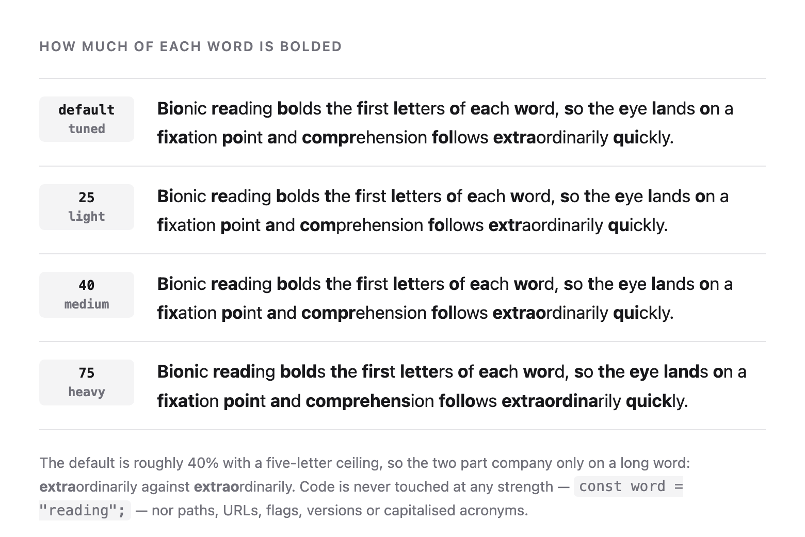

# claude-bionic-reading

Bionic reading bolds the first letters of each word. The eye lands on the bold
part, the mind fills in the rest, and a line gets scanned instead of read letter
by letter. This plugin puts that in front of everything Claude Code writes.

**Bio**nic **rea**ding **ma**kes **wo**rds **eas**ier **t**o **sc**an.



It covers three places, in the way that suits each:

| Where | How | Exact? |
| ----- | --- | ------ |
| Replies in the chat | a `UserPromptSubmit` hook restates the fixation rules each turn | model-applied |
| Artifacts and HTML pages | a dependency-free script inlined into the page | yes |
| Markdown, text and other files on disk | a converter run over the finished file | yes |

Nothing else changes. Same wording, same structure, same Markdown, same styles.
Bold stops meaning emphasis and starts meaning *look here*, so no emphasis is
added or removed anywhere.

**Code is never touched.** Not fenced blocks, not indented blocks, not inline
spans, and not the things that read like code in the middle of a sentence —
paths, URLs, flags, identifiers, environment variables, versions, numbers and
capitalised acronyms all keep their shape.

## Install

Two steps, whichever route you take: **add the marketplace, then install the
plugin from it.** Adding a marketplace only registers where plugins come from.
It installs nothing, and stopping there is the easiest way to end up with a
plugin that appears to be set up and never runs.

### In the Claude Code app

1. Open **Settings → Extensions → Browse Extensions → Plugins**.
2. Click **Add**, then **Add Marketplace**.
3. Paste the repository when it asks for a marketplace, and confirm:

   ```
   dscx/claude-app-plugin-bionic-reading
   ```

4. `claude-bionic-reading` now appears in the marketplace list. **Open it.**
5. Click **Install** on **Bionic Reading** inside it.

Step 5 is the one that counts, and the one that is easy to miss: after step 3
the marketplace is listed and everything looks finished, but no plugin has been
installed and nothing will happen.

### From the CLI

```bash
claude plugin marketplace add dscx/claude-app-plugin-bionic-reading
```

```bash
claude plugin install claude-bionic-reading@claude-bionic-reading
```

### From a clone

```bash
git clone https://github.com/dscx/claude-app-plugin-bionic-reading.git
```

```bash
claude plugin marketplace add ./claude-app-plugin-bionic-reading
```

```bash
claude plugin install claude-bionic-reading@claude-bionic-reading
```

### Then open a new conversation

Hooks are bound when a session starts, so a conversation that was already open
when you installed will never go bionic. Restarting the app does not help
either — it resumes the same conversation. Open a new chat and it takes effect
on the first message.

Two commands tell you where you stand: `claude plugin list` shows whether it is
installed and enabled, and `/bionic status` shows whether it is switched on.

## Use

```
/bionic          toggle
/bionic on
/bionic off
/bionic status   state and strength
```

And to change how much of each word is bolded:

```
/bionic default  the tuned table, about 40% with a five-letter ceiling
/bionic 25       light
/bionic 40       medium
/bionic 75       heavy
```

A new strength applies from the next reply. Setting one does not switch the
plugin on, so `/bionic 75` while it is off changes what happens later, not now.

Both settings are a single word in a file: `~/.claude/bionic-reading/state` and
`~/.claude/bionic-reading/strength`. Missing means on, at the default strength.
`CLAUDE_BIONIC_STATE` and `CLAUDE_BIONIC_STRENGTH_FILE` move them.

Turning it off silences the hook from the next turn onward. It does not rewrite
anything already produced — for that, see `--strip` below.

## Strength

Four settings, shown in the picture above. `default` is a tuned table; the other
three are literal percentages of the letters in each word.

| Letters | `25` | `40` | `default` | `75` |
| ------- | ---- | ---- | --------- | ---- |
| 1       | —    | —    | —         | —    |
| 2–3     | 1    | 1    | 1         | 1–2  |
| 4–5     | 1    | 2    | 2         | 3–4  |
| 6–7     | 2    | 2–3  | 3         | 5    |
| 8–9     | 2    | 3–4  | 4         | 6–7  |
| 10–13   | 3    | 4–5  | 5         | 8–10 |
| 14+     | 4+   | 6+   | 5         | 11+  |

`default` is roughly `40` with a five-letter ceiling, so the two only part
company on a long word: **extra**ordinarily against **extrao**rdinarily. The
ceiling is why it is the default — past five letters a longer prefix stops
helping and starts shouting.

Two invariants hold at every strength, and they are not cosmetic:

- **A one-letter word is never bolded.**
- **No word is ever bolded whole**, and the bold always stops before a letter,
  so an apostrophe never follows it: **do**n't, never **don**'t.

Together they mean a bionic bold run is exactly a `**…**` that ends in the
middle of a word — which nothing in ordinary writing produces. That is the
signature `--strip` matches, and it is what makes the conversion reversible.

Each surface takes the strength its own way:

```bash
python3 scripts/bionicize.py --strength 75 notes.md
```

```html
<script>window.BIONIC_STRENGTH = '75';</script>
```

```html
<html data-bionic-strength="75">
```

To go beyond the four, edit `prefix_letters` in
[`scripts/bionicize.py`](scripts/bionicize.py) and `prefixLetters` in
[`assets/bionic.js`](assets/bionic.js). They are the same function twice, and a
test compares them at every strength and every word length, so they cannot
quietly drift apart.

## Converting files yourself

```bash
python3 scripts/bionicize.py notes.md > notes.bionic.md
```

```bash
python3 scripts/bionicize.py -i notes.md
```

```bash
python3 scripts/bionicize.py --strip -i notes.md
```

`--strip` is exact: it removes a `**…**` run that ends in the middle of a word,
which is the one thing this converter produces and normal writing never does.
Real emphasis survives untouched, so the round trip is byte for byte.

Other flags: `--plain` treats input as plain text rather than Markdown, `-o`
writes elsewhere, and with no file argument it reads stdin. Standard library
only, no dependencies.

## Converting a page yourself

Paste [`assets/bionic.js`](assets/bionic.js) into a `<script>` tag at the end of
the page. It walks the text nodes, wraps each fixation prefix in
`<b class="bionic">`, and leaves the DOM, the text and every style as they were.
It skips `code`, `pre`, `kbd`, `samp`, `script`, `style`, `textarea`, `svg`,
`math` and anything already bold, keeps watching for content added later, and is
safe to run more than once.

Opt a subtree out with `data-no-bionic`:

```html
<blockquote data-no-bionic>Quoted verbatim, so left alone.</blockquote>
```

Fixations are `font-weight: bolder`, which is relative — a prefix stays heavier
than whatever weight it sits in, and inherits everything else.

Open [`tests/demo.html`](tests/demo.html) in a browser to see it working.

## What to expect

The two converters are deterministic and exact. **The chat replies are not.**
There is no rendering layer to hook into, so the hook asks the model to write
its prose that way, and a model applying a rule thousands of times per
conversation will not be perfect. Expect the occasional missed word, and expect
it to lapse for a moment after a long tool result. Replies also grow by roughly
four characters per word, which costs output tokens.

Both are the price of doing this without a client that supports it natively. If
what you want is exactness, ask for a document or an artifact — those go through
the converters.

Bolding inside a word relies on CommonMark's intra-word strong emphasis
(`**Bio**nic`). Every renderer in Claude Code handles it. Some other Markdown
tools do not.

## What is in here

```
.claude-plugin/plugin.json    manifest
hooks/hooks.json              one UserPromptSubmit hook
hooks/user-prompt-submit.sh   restates the rules each turn, honours the toggle
commands/bionic.md            /bionic
skills/bionic-reading/        how to bionic an artifact or a document
assets/bionic.js              the renderer for HTML
scripts/bionicize.py          the converter for Markdown and text
docs/build-example.js         rebuilds the picture above from the renderer
docs/render-example.sh        and shoots it with headless Chrome
tests/run-tests.sh            the checks
```

The hook never reads the submitted prompt. It drains stdin, drops it, and writes
a fixed block of text. Nothing is logged and nothing leaves the machine.

## Tests

```bash
tests/run-tests.sh
```

## Licence

MIT. See [LICENSE](LICENSE).
